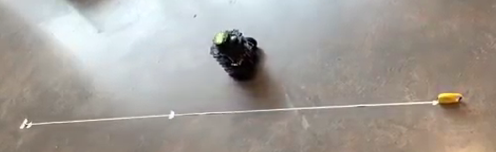
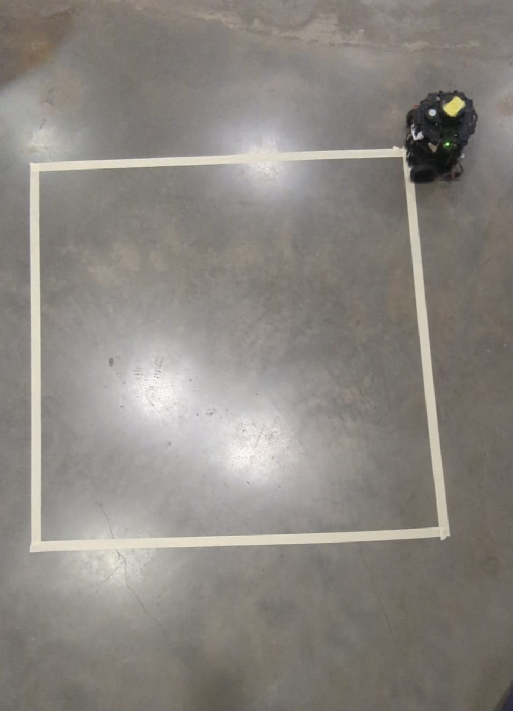

# Circle.py

## Analysis
Our thinking for the open-loop circle test would be to try to create the same radius circle for each run. Slow and medium runs should go as expected and we would crank the speed for fast until some unexpected behavior occured. To set the same radius for each run we used the equation:

v = rw --> r = v_x / w_z

Basically, we had to choose a v_x and w_z that would create a circle that fit in our space. Then increase v_x and w_z by the same factor to maintain our radius.

We started by setting v_x and w_z to 1. This made a circle, as expected. We then multiplied both by v_x and w_z by 2 and got a way smaller circle. We knew something was wrong. We didn't know what units the turtlebot was interpretting when we told it v_x = 1 so we decided to run a straight line calibration test. 

We setup a 2m straight line, commanded the turtlebot to move at a certain v_x and timed how long it took to travel it. Assuming constant velocity, we could derive the actual velocity using this equation:

v = d/t , where d = 2m and t = our timed result.

These were our results:
<!-- Need this space so image and text won't be on same line -->

The figure shows a clear saturation and linear region. As the results were coming out, we saw the linear region finished around 0.2 m/s so we tested more velocities near that command. We ultimately decided the top linear speed for the turtlebot is 0.2 m/s.

The linear region can be seen here:

And the raw data can be seen here:

As can be seen from the raw data, within the linear region, the commanded velocity and actual velocity are basically 1:1. So now we know that when we command a velocity to the turtlebot it is interpretting it in m/s. This actually makes sense since the turtlebot motors have built-in encoders, so assuming you have the units right, if you command 0.1 m/s the motors should produce very close to 0.1 m/s- which they did. We also found out that our initial guess of v_x = 1 for our first run was already way into the saturation region and the turtlebot was actually going about 0.2 m/s-no where near 1 m/s. That is why we were getting unexpected circles.

We now had an upper limit on our v_x and began doing the same calibration process for our w_z. We did a couple of runs which can be seen here:

And the raw data can be seen here:

But we stopped when we realized that having the independent maxes for linear velocity and angular velocity isn't very useful since we can't simoultaneously get both at the same time. For example if we command the turtlebot to move at 0.2 m/s then we ask it to turn at 2 rad/s, the motor at the outer wheel won't be able to accomplish this. This is because the outer wheel in a circle always has to move faster than the inner wheel. So if the turtlebot is already going at max linear speed, the outer wheel motor now can't speed up anymore to begin differential turning. So we would have to come up with combinations of v_x and w_z that combined did not exceed the outer wheel's max motor speed of 0.2 m/s.

We settled on:

* Slow: v_x = 0.1 and w_z = 0.333

* Medium: v_x = 0.15 and w_z = 0.5

* Fast: v_w = 0.2 and w_z = 0.66

The videos of each run can be seen here:

* Slow: LINK!

* Medium: LINK!

* Fast: LINK!

As predicted, slow and medium both traced a circle of 0.33m radius. Fast, created a bigger circle because the turtlebot motors could not produce the commanded velocities so our equation assumption broke down. We don't know if the turtlebot tries to maintain the angular or linear velocity when one is maxed out but since our circle grew rather than shrank from medium to fast, we expecct it is trying to maintain the v_x at the cost of w_z. We don't know why that is.

P.S. we later found out we could check the maximum linear velocity and angular velocity on the Robotis website and their results match ours.

# Square.py

## Analysis

The analysis for circle.py for longituidnal motion holds good for square.py also.

For sqaure open loop control, we created a square setup in the ground for understanding the turtbot behaviour if itrs following the desired trajectory.

The sqaure setup was ran for 3 different velocities - 
1. Slow (0.05 m/s)
2. Medium  (0.1 m/s)
3. Fast  (0.2 m/s)

Observations:
 The slow and medium maintained their trajectory , the slow one was the best but the medium speed deviated after the second turn and the error compounded in the third turn.
 
Analysis based on the Time Taken by turtlebot to maneuver square trajectory-
Fast Speed - 36 seconds
Medium Speed - 46 seconds
Slow Speed - 65 seconds

For the fast speed it had the maximum deviation as the angular speed was also high which led to misalignment while following the turn trajectory. To understand the motion of turtlebot in a different surface(Another friction Coefficient - Cd) we also ran the square in the carpet which had a variation in the trajectory comapred to the previous expreiment observation. This shows how the same code acts differently in Gazebo environment and real time.

