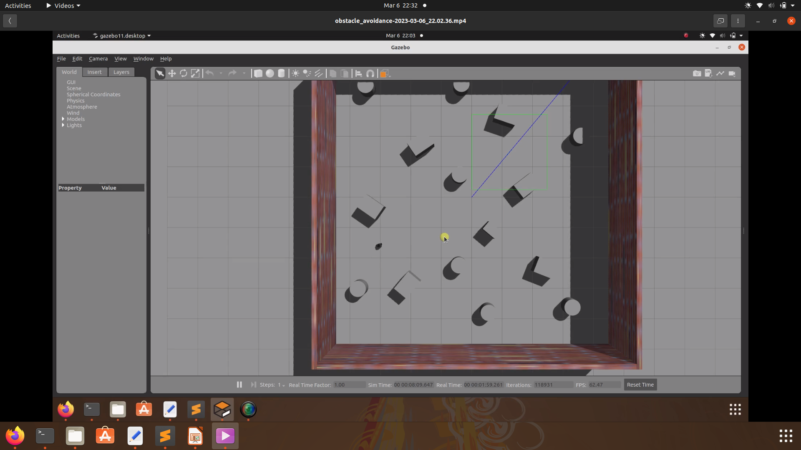

# Part 1 - Wall Follow

## Execute Launch File

roslaunch assignment3a_wallfollowingandobstacleavoidance wallFollow.launch --screen

## Launch File Explanation

Launch file consists of 5 sections:

1. Set initial x,y,z position of turtlebot in world
2. Find the world we want to launch in gazebo (we saved the provided world files in /worlds folder)
3. Load xacro file for turtlebot3 burger
4. Launch first node which is gazebo simulator with our chosen world
5. Launch second node which is the python script to control the turtlebot

NOTE: Odd that gazebo calculated a different trajectory for the turtlebot when screen was being recorded vs not.

# Part 2 - Obstacle Avoidance

For this the scan data from the Lidar has to be used to sense the obstacles and take evasive maneuvers to avoid it.
The 1st part includes the logic which is taken from the hint in the question itself, but instead of segregating the zones into multiple angle instances and taking the average and comparing them to the the orientation, the zones were converted into segments of 4-6 and each segment value was used individually to obtain the obstacles nearby and rotate based on the fixed distance or safe distance, which was set as 0.5
If the front distance > 0.5 then the bot can continue straight, the same applies for left and right. 
This process continues as the bot traverses around the entire map. The turtlebot3_obstacles.world was used as shown below:

Steps to launch:
1. As all the parameters are preset, and it is a standalone code, just run the Launch file - assignment3a_turtlebot3_T2.launch 

## Execute Launch File

roslaunch assignment3a_wallfollowingandobstacleavoidance assignment3a_turtlebot3_T2.launch --screen

# Part 3 - Obstacle Avoidance - Actual Turtlebot

Setup - As instructed we setup a few obstacles on the 4th floor CGEC for the actual run of the obstacle avoidance. 
The wander.py file was run.
Issues: Unlike gazebo /scan where the lidar returned inf value when it exceeded a certain threshold, the actual Lidar returned a value of 0. Which meant that when ever the front reading returned 0, the bot stopped as according to the code if the value went below the threshold, it should stop. 
A find function was implemented to parse the 0 values and set it to some set value = 20, but that also did not seem to work.
This can be seen in the videos uploaded to the videos folder (4 runs uploaded)

Readings after running the Gazebo code:

Range at 0 degress: 0.5839999914169312
Range at 30 degress: 0.0
Range at 330 degress: 0.0
Range at 90 degress: 0.0
Range at 60 degress: 3.8510000705718994
Range at 120 degress: 0.0
Range at 270 degress: 2.7739999294281006
Range at 300 degress: 0.0
Range at 240 degress: 0.0

Problem: The lidar returned readings of 0 for anything outside the range.

Fix: 
       front = msg.ranges[0]
        #front1 = msg.ranges[15]
        #front2 = msg.ranges[44]
        front_left = msg.ranges[30]
        #front_right1 = msg.ranges[345]
        front_right = msg.ranges[330]
        #front_right2 = msg.ranges[314]

        if front==0:
           front = 20
        else:
           front=front
        
        if front_left==0:
           front_left = 20
        else: 
           front_left=front_left

Now the readings were assigned an arbritrary value above the Lidars max (= 20), hence the bot would move in that direction

New readings after update:

front 0 deg: 0.546999990940094
front_left 30 deg: 2.3499999046325684
front_right 330 deg: 20
left 90 deg: 0.27399998903274536
left_top 60 deg: 0.6919999718666077
left_bottom 105 deg: 20
right 270 degress: 3.7049999237060547
right_top 90 deg: 20
right_bottom 90 deg: 20

## Execute Launch File

roslaunch assignment3a_wallfollowingandobstacleavoidance wander.launch --screen

# Part 4 - Emergency Braking

For this task, it uses a similar logic as the obstacle avoidance part, hence with a slight change to the code, the emergency braking maneuver could be performed.
The set limit or threshold was set and the vel.linear.x was set to 0 as the deitance or /scan data went below the threshold (dist).

Steps to launch:
1. As all the parameters are preset, and it is a standalone code, just run the Launch file - assignment3a_turtlebot3_T4.launch 

## Execute Launch File

roslaunch assignment3a_wallfollowingandobstacleavoidance assignment3a_turtlebot3_T4.launch --screen
